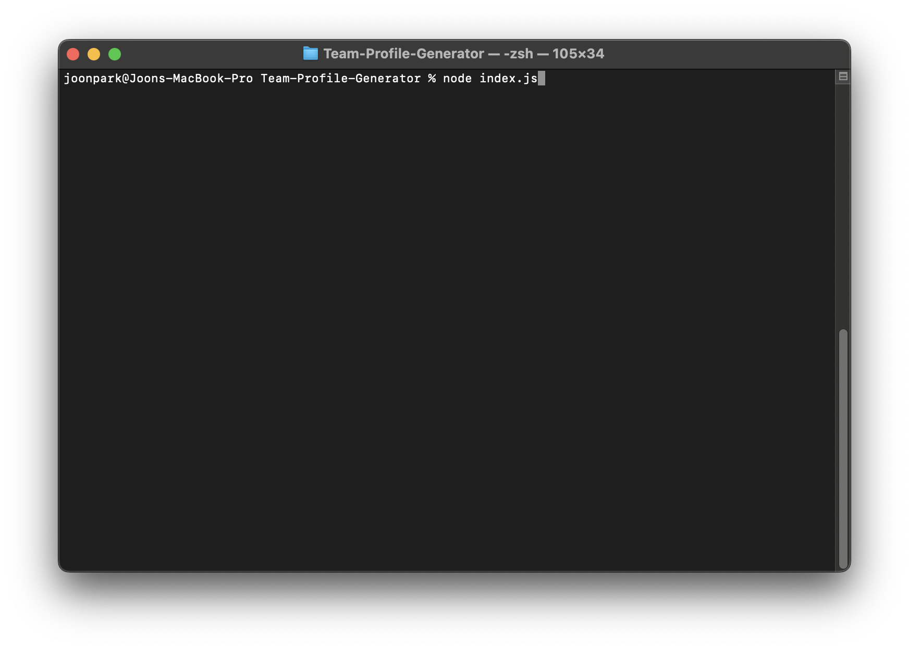
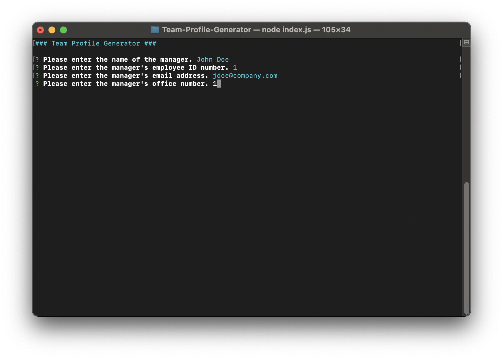

# Team-Profile-Generator

## Description

[](https://opensource.org/licenses/MIT)

A command-line application that generates an html file for a team with the profile of each member of the team.

## Usage

Clone this repo into a local folder. Enter the following node command into Terminal/command prompt to run the application:

```shell
node index.js
```



Follow the prompts to enter basic information about the manager.



At the end of the prompts about the manager, you will be prompted to enter additional information for the engineers and/or interns on the team.


After you have finished adding all team members, the application will generate style.css and team.index files in the /dist folder.


## Walkthrough Video

[Walkthrough Video](https://www.youtube.com/watch?v=b8oHl0OWEo0)

## License

Licensed under the MIT license.